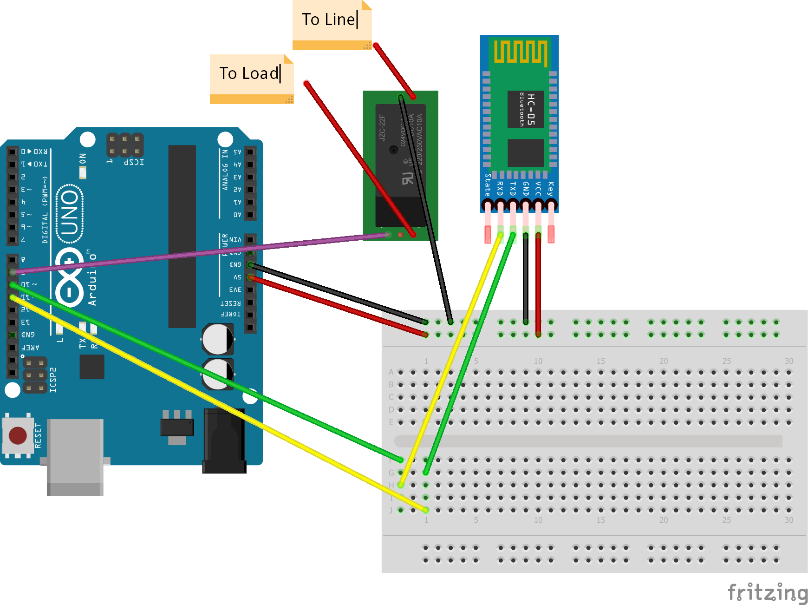

# IOT_java_project
<h2>Bluetooth-Home-Automation<h2>
 <h3>Description</h3>

A solution to control home appliances using a Bluetooth device(Android Smartphone).
 
This repository consists of source code for an Android app as well as Arduino configuration.

<h3>Requirements</h3>
<ol>
<li>Arduino Development Board</li>
<li>HC-05 or HC-06 Bluetooth Module</li>
<li>5V DC / 220V AC Relays</li>
<li>Android Bluetooth Device</li>
<li>Connecting Wires</li>
</ol>   
<h4>Steps to setup Arduino</h4>
 <ol>
<li>Upload the arduin code in repository root to Arduino controller</li>
<li>Connect PIN 11(TX) pin of Arduino to RX pin of HC-05</li>
<li>Connect PIN 10(RX) pin of Arduino to TX pin of HC-05</li>
<li>Connect 5V of Arduino to Vin of HC-05 and Vcc of relays</li>
<li>Connect GND of Arduino to GND of HC-05 and GND of relays</li>
<li>Connect IN of relay to PIN 13 of Arduino board(you are free to use any pin and also multiple pins, just update the arduino code)</li>
<li>Connect 220V AC Line to Pole and Load(appliance) to NO of the relay</li>
<li>Power the Arduino board and you're ready to use. </li>
  </ol>   
<h5>Refer to circuit diagram for setup<h5>
<h4>Circuit Diagram</h4> 

 
<h4>How to use<h4>
 
 <ul>
<li>Build an install the app on an Android Bluetooth device.</li>
<li>Turn Bluetooth ON and pair with HC-05 using passcode 1234 (default passcode, you are free to change)</li>
<li>Open the app, click on select conntroller and select the HC-05</li>
<li>Use ON/OFF buttons to control the appliance</li>
</ul> 
<h4>Purpose<h4>
Mini Project for Bachelor of Technology,

<h4>Developed by<h4>

<u>Team Consol Dot Log</u>
